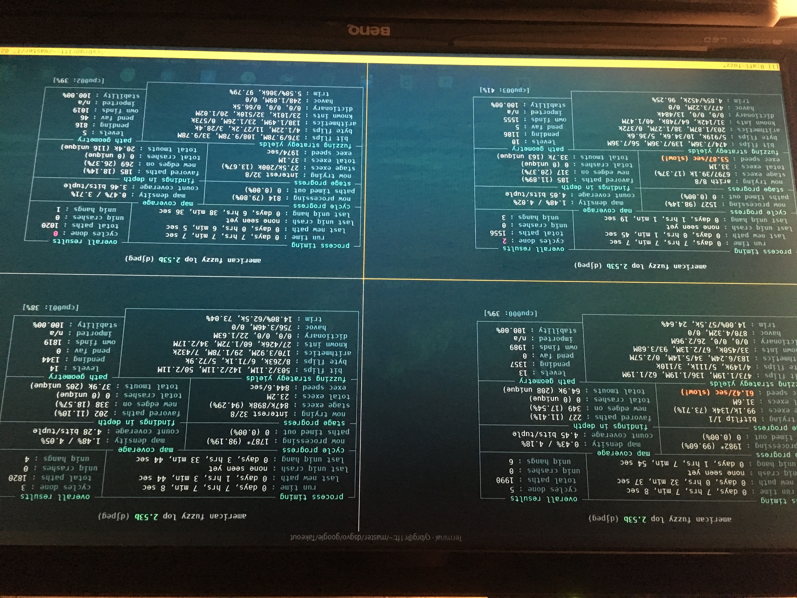
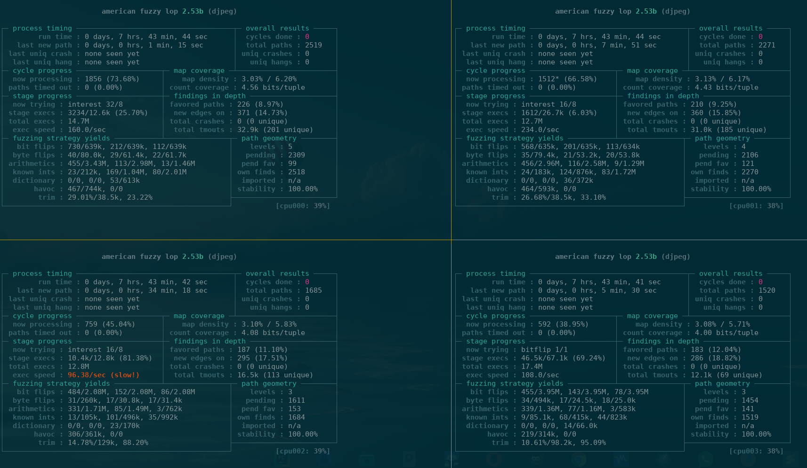
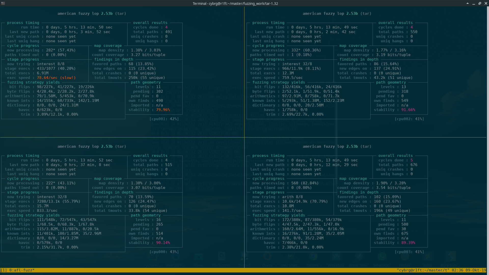

## Fuzzing work on supertemplates for fuzzing

## Thoughts on libjpeg-turbo
### Linksave
https://github.com/libjpeg-turbo/libjpeg-turbo
https://www.thexifer.net/

### Why choosing JPEG as target to research
Jpeg is a well known and very old pretty good fuzzed parser.
- a lot coverage can be discovered in short amount of time
- a lot of different options
- high diversity in metadata to put inside the header

### build
`git clone https://github.com/libjpeg-turbo/libjpeg-turbo`

`cd libjpeg-turbo`

`cmake -G"Unix Makefiles" -DCMAKE_C_COMPILER=afl-gcc -DCMAKE_C_FLAGS=-m32 libjpeg-turbo/`

`make -j16`

### fuzzing

#### analysing behaviour of 4 different inputs
The base input we choose is a very small 1x1 pixel JPEG with 107 bytes in size and no metadata/EXIF information.

- 1. sample: raw.jpeg exactly the base input
- 2. sample: raw.jpeg_1 base input with one additional metadata information 
- 3. sample: raw.jpeg_10 base input with 10 metadata additional information
- 4. sample: raw.jpeg_all base input with all available metadata information on the online JPEG metadata editor

As second validation step we choose to repeat this experiment with a real not stripped jpeg with ca. 10 times the size and see if we get the same or slightly different results.

- 1. sample: real.jpeg exactly the base input
- 2. sample: real.jpeg_1 base input with one additional metadata information 
- 3. sample: real.jpeg_10 base input with 10 metadata additional information
- 4. sample: real.jpeg_all base input with all available metadata information 

#### Thoughts on results
- first(upper left): mostly linear coverage grade from small binary with no metadata to most voverage
- second(upper right): slightly more complex input little less coverage
- third(bottom left): a lot more complex a lot less coverage
- fourth(bottom right): super complex lowest coverage 

#### TAR
`tar --overwrite -xvf in/directory_min.tar`
`afl-fuzz -i in/ -o out/ ../../../fuzzing_work/tar-1.32/src/tar --overwrite -xvf @@`
`afl-fuzz -i in/ -o out/ ../../../fuzzing_work/tar-1.32/src/tar xvfj @@ --directory tmp/`

#### vlc

Download from git 
`git clone https://github.com/videolan/vlc.git`

`./bootstrap`

Compile with afl and enable debug symbols
`./configure CC=afl-gcc CXX=afl-g++ --enable-debug --disable-qt --disable-vulkan`

compile 
`make -j16`

## Other intresting Parsers
- SIP
- HTML
- HTTP
- TAR

## ramdisk fuzzing

https://github.com/mrash/fwknop/blob/master/test/afl/fuzzing-wrappers/server-digest-cache.sh

`mkdir /tmp/afl-ramdisk && chmod 777 /tmp/afl-ramdisk`
`sudo mount -t tmpfs -o size=512M tmpfs /tmp/afl-ramdisk`

## corpus for jpeg data
http://lcamtuf.coredump.cx/afl/demo/
https://github.com/uclouvain/openjpeg-data
https://research.checkpoint.com/50-adobe-cves-in-50-days/

mp3 which program?
vlc couldnt compile it as vlc-static since every libary is leaded dynamically
